# Homelab Data Mesh Architecture

The following diagram illustrates the data mesh architecture for our homelab environment, with RabbitMQ as the central message broker orchestrating all communication between components.

## Architecture Overview

```mermaid
C4Context
    title Homelab Data Mesh Architecture

    Enterprise_Boundary(homelab, "Homelab Environment") {
        %% Message Broker (Central Component)
        System_Boundary(broker, "Message Broker") {
            System(rabbitmq, "RabbitMQ", "Central message broker for the homelab data mesh", $tags="message-broker")

            %% Exchanges by domain
            Component(ex_home, "Home Events Exchange", "topic: home.events", $tags="exchange,home")
            Component(ex_sensors, "Sensors Exchange", "topic: sensors", $tags="exchange,sensors")
            Component(ex_metrics, "Metrics Exchange", "topic: metrics", $tags="exchange,metrics")
            Component(ex_ai, "AI Exchange", "topic/direct: ai", $tags="exchange,ai")
            Component(ex_alerts, "Alerts Exchange", "fanout: alerts", $tags="exchange,alerts")
            Component(ex_archive, "Archive Exchange", "topic: archive", $tags="exchange,archive")
            Component(ex_dead, "Dead Letter Exchange", "direct: dead.letter", $tags="exchange,system")
        }

        %% Producer Systems
        System_Boundary(producers, "Data Producers") {
            System(home_assistant, "Home Assistant", "Smart home automation platform", $tags="producer,home")
            System(triton, "Triton Inference Server", "AI model inference", $tags="producer,ai")
            System(k8s_services, "Kubernetes Services", "Various microservices", $tags="producer,system")
            System(sensor_network, "Sensor Network", "IoT devices and sensors", $tags="producer,sensors")
            System(system_metrics, "System Metrics Collector", "Hardware and system metrics", $tags="producer,metrics")
        }

        %% Consumer Systems
        System_Boundary(consumers, "Data Consumers") {
            System(influxdb, "InfluxDB Consumer", "Time-series data storage", $tags="consumer,metrics")
            System(minio, "MinIO Archiver", "Long-term data storage", $tags="consumer,archive")
            System(n8n, "n8n Workflows", "Automation workflows", $tags="consumer,automation")
            System(ai_pipeline, "AI Pipeline", "ML processing pipeline", $tags="consumer,ai")
            System(alert_manager, "Alert Manager", "Alert handling and notification", $tags="consumer,alerts")
            System(analytics, "Analytics Platform", "Data visualization and analytics", $tags="consumer,analytics")
        }

        %% Queues by domain
        System_Boundary(queues, "Message Queues") {
            %% Home domain queues
            Component(q_home_events, "home.events.state_changes", "Home state changes queue", $tags="queue,home")
            Component(q_home_automations, "home.events.automations", "Home automation queue", $tags="queue,home")

            %% Sensor domain queues
            Component(q_sensors_temperature, "sensors.temperature", "Temperature sensor readings", $tags="queue,sensors")
            Component(q_sensors_humidity, "sensors.humidity", "Humidity sensor readings", $tags="queue,sensors")
            Component(q_sensors_motion, "sensors.motion", "Motion sensor events", $tags="queue,sensors")

            %% Metrics domain queues
            Component(q_metrics_system, "metrics.system", "System metrics queue", $tags="queue,metrics")
            Component(q_metrics_application, "metrics.application", "Application metrics queue", $tags="queue,metrics")

            %% AI domain queues
            Component(q_ai_inference, "ai.inference.requests", "AI inference requests", $tags="queue,ai")
            Component(q_ai_results, "ai.inference.results", "AI inference results", $tags="queue,ai")

            %% Alert domain queues
            Component(q_alerts_critical, "alerts.critical", "Critical alerts queue", $tags="queue,alerts")
            Component(q_alerts_notifications, "alerts.notifications", "Notifications queue", $tags="queue,alerts")

            %% Archive domain queues
            Component(q_archive_events, "archive.events", "Event archival queue", $tags="queue,archive")
            Component(q_archive_metrics, "archive.metrics", "Metrics archival queue", $tags="queue,archive")

            %% Dead letter queue
            Component(q_dead_letter, "dead.letter.queue", "Failed messages queue", $tags="queue,system")
        }

        %% Transformers
        System_Boundary(transformers, "Data Transformers") {
            System(transformers_pipeline, "Transformation Pipeline", "Data transformation service", $tags="transformer")
        }

        %% Relationships - Producers to Exchanges
        Rel(home_assistant, ex_home, "Publishes events", "JSON messages")
        Rel(sensor_network, ex_sensors, "Publishes readings", "JSON messages")
        Rel(system_metrics, ex_metrics, "Publishes metrics", "JSON messages")
        Rel(triton, ex_ai, "Publishes inference results", "JSON messages")
        Rel(k8s_services, ex_metrics, "Publishes service metrics", "JSON messages")

        %% Relationships - Exchanges to Queues
        Rel(ex_home, q_home_events, "Routes events", "home.*.*.state_changed")
        Rel(ex_home, q_home_automations, "Routes automation triggers", "home.*.*.trigger")
        Rel(ex_sensors, q_sensors_temperature, "Routes temperature data", "sensors.temperature.#")
        Rel(ex_sensors, q_sensors_humidity, "Routes humidity data", "sensors.humidity.#")
        Rel(ex_sensors, q_sensors_motion, "Routes motion events", "sensors.motion.#")
        Rel(ex_metrics, q_metrics_system, "Routes system metrics", "metrics.system.#")
        Rel(ex_metrics, q_metrics_application, "Routes app metrics", "metrics.application.#")
        Rel(ex_ai, q_ai_inference, "Routes inference requests", "ai.model.#")
        Rel(ex_ai, q_ai_results, "Routes inference results", "ai.result.#")
        Rel(ex_alerts, q_alerts_critical, "Routes critical alerts", "#")
        Rel(ex_alerts, q_alerts_notifications, "Routes notifications", "alerts.#")
        Rel(ex_archive, q_archive_events, "Routes events for archival", "#")
        Rel(ex_archive, q_archive_metrics, "Routes metrics for archival", "#")
        Rel(ex_dead, q_dead_letter, "Routes failed messages", "#")

        %% Relationships - Queues to Consumers
        Rel(q_metrics_system, influxdb, "Consumes metrics", "Batch writes")
        Rel(q_metrics_application, influxdb, "Consumes metrics", "Batch writes")
        Rel(q_archive_events, minio, "Consumes for archive", "Batch compress")
        Rel(q_archive_metrics, minio, "Consumes for archive", "Batch compress")
        Rel(q_home_events, n8n, "Consumes events", "Triggers workflows")
        Rel(q_sensors_motion, n8n, "Consumes motion events", "Triggers workflows")
        Rel(q_ai_inference, triton, "Consumes inference requests", "Processing")
        Rel(q_ai_results, ai_pipeline, "Consumes inference results", "ML pipeline")
        Rel(q_alerts_critical, alert_manager, "Consumes alerts", "Notifications")
        Rel(q_alerts_notifications, alert_manager, "Consumes notifications", "User alerts")

        %% Relationships - Transformations
        Rel(q_sensors_temperature, transformers_pipeline, "Transforms data", "Unit conversion")
        Rel(q_sensors_humidity, transformers_pipeline, "Transforms data", "Unit conversion")
        Rel(transformers_pipeline, influxdb, "Sends transformed data", "Time-series format")
        Rel(transformers_pipeline, analytics, "Sends processed data", "Analytics format")
    }

    %% External systems
    System_Ext(mobile_app, "Mobile App", "User interface for notifications and control")
    System_Ext(grafana, "Grafana", "Metrics visualization")

    %% External relationships
    Rel(alert_manager, mobile_app, "Sends notifications", "Push notifications")
    Rel(influxdb, grafana, "Provides metrics", "InfluxDB API")

    UpdateElementStyle(rabbitmq, $bgColor="#1168bd", $fontColor="white")

    UpdateElementStyle(home_assistant, $bgColor="#41BDF5")
    UpdateElementStyle(triton, $bgColor="#00B4A0")
    UpdateElementStyle(sensor_network, $bgColor="#86DAF1")
    UpdateElementStyle(system_metrics, $bgColor="#4CAF50")

    UpdateElementStyle(influxdb, $bgColor="#22ADF6")
    UpdateElementStyle(minio, $bgColor="#C72E49")
    UpdateElementStyle(ai_pipeline, $bgColor="#00ABA9")
    UpdateElementStyle(alert_manager, $bgColor="#FF9800")

    %% Color-coding for exchanges by domain
    UpdateElementStyle(ex_home, $bgColor="#41BDF5")
    UpdateElementStyle(ex_sensors, $bgColor="#86DAF1")
    UpdateElementStyle(ex_metrics, $bgColor="#4CAF50")
    UpdateElementStyle(ex_ai, $bgColor="#00ABA9")
    UpdateElementStyle(ex_alerts, $bgColor="#FF9800")
    UpdateElementStyle(ex_archive, $bgColor="#C72E49")
    UpdateElementStyle(ex_dead, $bgColor="#757575")

    %% Color-coding for queues by domain
    UpdateElementStyle(q_home_events, $bgColor="#41BDF5", $borderColor="#000000")
    UpdateElementStyle(q_home_automations, $bgColor="#41BDF5", $borderColor="#000000")
    UpdateElementStyle(q_sensors_temperature, $bgColor="#86DAF1", $borderColor="#000000")
    UpdateElementStyle(q_sensors_humidity, $bgColor="#86DAF1", $borderColor="#000000")
    UpdateElementStyle(q_sensors_motion, $bgColor="#86DAF1", $borderColor="#000000")
    UpdateElementStyle(q_metrics_system, $bgColor="#4CAF50", $borderColor="#000000")
    UpdateElementStyle(q_metrics_application, $bgColor="#4CAF50", $borderColor="#000000")
    UpdateElementStyle(q_ai_inference, $bgColor="#00ABA9", $borderColor="#000000")
    UpdateElementStyle(q_ai_results, $bgColor="#00ABA9", $borderColor="#000000")
    UpdateElementStyle(q_alerts_critical, $bgColor="#FF9800", $borderColor="#000000")
    UpdateElementStyle(q_alerts_notifications, $bgColor="#FF9800", $borderColor="#000000")
    UpdateElementStyle(q_archive_events, $bgColor="#C72E49", $borderColor="#000000")
    UpdateElementStyle(q_archive_metrics, $bgColor="#C72E49", $borderColor="#000000")
    UpdateElementStyle(q_dead_letter, $bgColor="#757575", $borderColor="#000000")
```

## Domain Color Legend

- **Blue (#41BDF5)**: Home Automation Domain
- **Light Blue (#86DAF1)**: Sensor Domain
- **Green (#4CAF50)**: Metrics Domain
- **Teal (#00ABA9)**: AI/ML Domain
- **Orange (#FF9800)**: Alerts Domain
- **Red (#C72E49)**: Archival Domain
- **Gray (#757575)**: System/Error Handling

## Message Routing Patterns

The data mesh uses several routing patterns:

1. **Topic-based routing**: Used for most exchanges to route messages based on hierarchical routing keys
   - Example: `sensors.temperature.living_room` routes to temperature queue

2. **Fanout routing**: Used for alerts to broadcast to all bound queues
   - All critical alerts are sent to every consumer bound to the alerts exchange

3. **Direct routing**: Used for specific services like the AI exchange and dead letter exchange
   - Messages are routed based on exact routing key match

## Data Flow Examples

### Sensor Data Flow
1. Temperature sensor publishes reading to `sensors` exchange
2. Message is routed to `sensors.temperature` queue based on routing key
3. Transformation pipeline converts units if needed
4. Data is consumed by InfluxDB for time-series storage
5. Selected data is archived to MinIO for long-term storage

### Alert Flow
1. System detects anomaly and publishes alert to `alerts` exchange
2. Alert is fanout to `alerts.critical` queue
3. Alert Manager consumes message and determines notification strategy
4. Alert is formatted and sent to external systems (mobile app, etc.)

### AI Inference Flow
1. Service publishes inference request to `ai` exchange
2. Request is routed to `ai.inference.requests` queue
3. Triton Inference Server processes the request
4. Result is published back to `ai` exchange
5. Result is routed to `ai.inference.results` queue
6. AI pipeline consumes result for further processing

## Error Handling

All queues are configured with dead-letter handling:
- Failed messages (after retries) are routed to the dead letter exchange
- The dead letter queue collects these messages for later analysis
- Messages include the original routing key and error information
