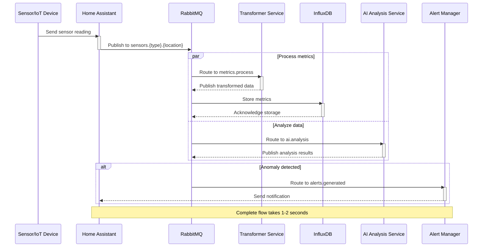
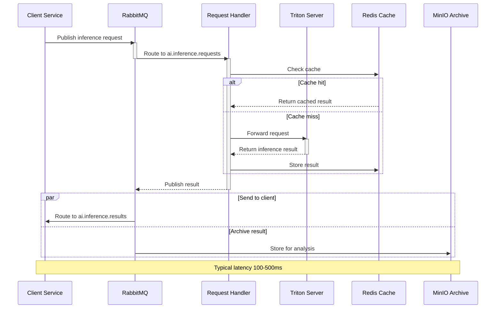
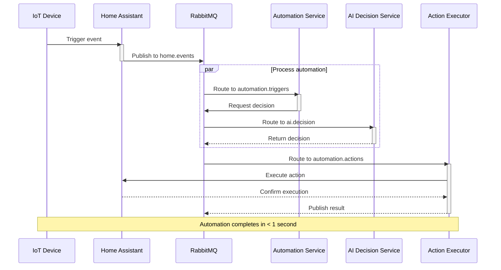
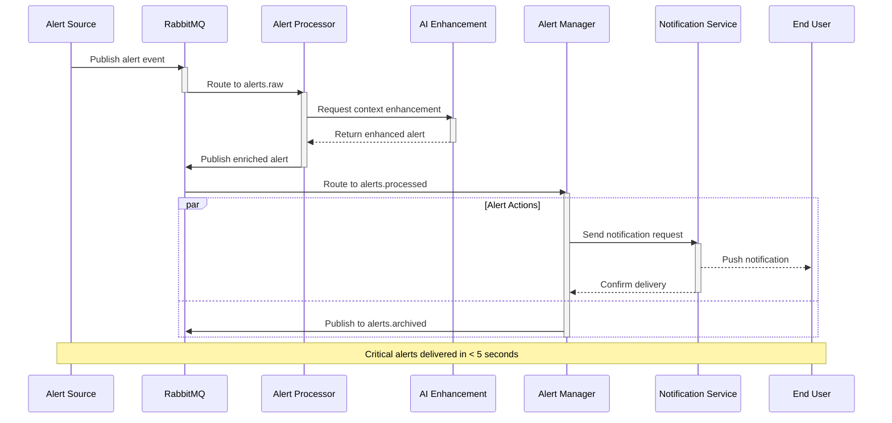

# Message Sequence Flows in Homelab Data Mesh

This document illustrates the key message flows through the homelab data mesh architecture using sequence diagrams.

## 1. Sensor Data Collection and Analysis Flow

## 2. AI Inference Request/Response Flow

## 3. Event-Triggered Automation Flow

## 4. Alert Generation and Notification Flow

## Message Flow Notes

1. **Data Flow Principles**
   - All messages are JSON formatted
   - Messages include timestamps and correlation IDs
   - Failed messages are routed to dead letter queues
   - All flows support retry mechanisms

2. **Performance Targets**
   - Sensor data processing: < 2 seconds
   - AI inference: < 500ms (cached), < 2 seconds (uncached)
   - Automation triggers: < 1 second
   - Critical alerts: < 5 seconds

3. **Error Handling**
   - All services implement circuit breakers
   - Failed messages are retried 3 times
   - Critical errors trigger system alerts
   - All errors are logged and monitored

4. **Scalability**
   - Services are horizontally scalable
   - Message batching for high-volume flows
   - Caching for repeated operations
   - Load balancing across service instances
